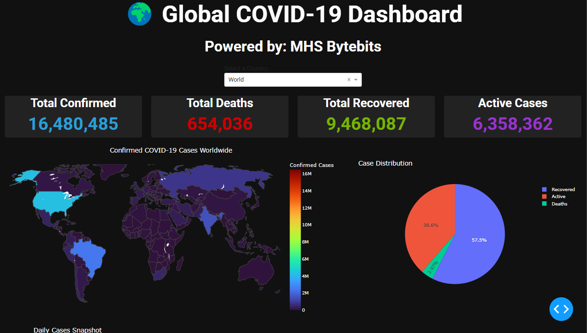

# 🌍 COVID-19 Global Dashboard  
Welcome to the **COVID-19 Global Dashboard** — an interactive dashboard built using **Dash**, **Plotly**, and **Pandas** to visualize global COVID-19 statistics in real-time. This project presents key indicators like total confirmed cases, deaths, recoveries, and active cases, along with detailed charts and maps for individual countries and worldwide insights.  

## 📸 Dashboard Preview  


## 📂 Project Structure  
```
├── countries_lat_long.csv   # Country latitude and longitude data  
├── country_wise_latest.csv  # COVID-19 dataset from Kaggle  
├── dashboard.py             # Main Python code to run the dashboard  
└── country_long_lat_data.py # Project documentation (you're here!)
└── README.md                # Project documentation (you're here!)  
```

## 🚀 How to Run the Project  

### 1. Install Required Libraries  
```bash
pip install dash pandas plotly dash-bootstrap-components countryinfo
```  
### 2. Run the Dashboard  
```bash
python dashboard.py
```  
### 3. View in Browser  
Open your browser and go to:  
```
http://127.0.0.1:8050/
```

## 📊 Features  
- **Select a Country** from the dropdown to view detailed statistics.  
- **KPIs (Key Performance Indicators)** for:  
  - Total Confirmed Cases  
  - Total Deaths  
  - Total Recovered  
  - Active Cases  
- **Global Map** showing the spread of COVID-19.  
- **Pie Chart** of case distribution (Active, Recovered, Deaths).  
- **Bar Chart** showing New Cases, New Deaths, and New Recoveries.  
- **Dark Theme UI** using Dash Bootstrap Components (Cyborg Theme).  


## 📈 Data Sources  
- [COVID-19 Dataset from Kaggle](https://www.kaggle.com/datasets/imdevskp/corona-virus-report)  
- Country Latitude and Longitude Dataset  

## 🛠️ Built With  
- [Dash](https://dash.plotly.com/)  
- [Plotly](https://plotly.com/python/)  
- [Pandas](https://pandas.pydata.org/)  
- [Dash Bootstrap Components](https://dash-bootstrap-components.opensource.faculty.ai/)

## ✨ Author  
**Muhammad Hassan Saboor**  
_Data Analyst | ML & Deep Learning Enthusiast_  


## 📜 License  
This project is open-source and available for everyone.

---

# 🌟 Show Some Love!  
If you like this project, please ⭐️ the repository!
